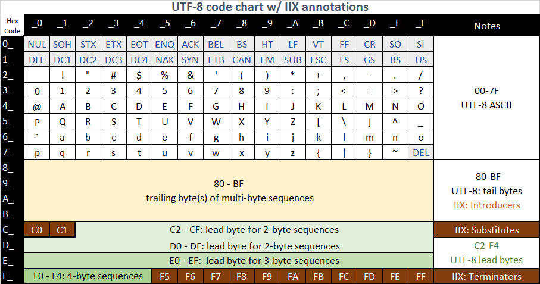

# IIX: Internet Information eXchange  
 *  Copyright 2016 by Burt Harris,  published under the [Apache-2.0 License](LICENSE).*

This project is for the design **IIX**, a flexible byte-oriented [sesson layer](https://en.wikipedia.org/wiki/Session_layer) protocol; or streaming information [serialization](https://en.wikipedia.org/wiki/Serialization) format optimized for synergy with [UTF-8](https://en.wikipedia.org/wiki/UTF-8) character string encoding.  IIX has been designed to work well with for modern JavaScript implementations found both in web browsers and the latest generation of host-based environents like Node.js.   Its binary format is intended for machine-to-machine communications, information storage, and synchronization scenarios where text based formats like XML or [JSON](https://en.wikipedia.org/wiki/JSON) is are used today.

IIX uses a syntax focused on represented information compactly and efficently. Contrasting IIX to JSON, this new format wasn't designed to be directly compatible with plain text editors or tools.  The machine-to-machine scenario permits frugally leveraging the fully 8-bit transparent protocols used in the modern internet. Instead of visible punctuation like XML and JSON, IIX uses certain byte sequences that can never appear in UTF-8 as a way to extend it to represent information rather than just text.   Punctuation characters lik brackets, commas, quotes and spaces never  need special treatment.

## Extending UTF-8 into IIX

The well-defined structure of UTF-8 has certain explicit constraints which allow for it to be frugally extended, as illustrated by this chart: 

The IIX protocol starts with the following frugal assumptions for converting between *data* and *information*:

- All valid character data is encoded as UTF-8 with the lightly shaded codes above.
- ASCII characters (including controls) require only a single byte each, like UTF-8.
- Codes between hex C0 and C1 are used to encode substitution of earlier values.
- Codes between hex F5 and FF are used to encode information structure consisting of elements.
- Codes between hex 80 and BF, when used at the beginning of an element, introduce non-textual elements.

The highly regular structure of IIX allows for a highly efficent yet simple state machine scanner to efficently identify element boundries within a IIX bytestream.  The selection this representations allows for much of the scanning to be achieved using [Single Instruction Multiple Data (SIMD)](https://en.wikipedia.org/wiki/SIMD) instruction sets, even when implemented in high-level languages like modern JavaScript.  Design choice can lead to an order of magnitude reduction in the scanning time on modern processors, which have been optimized to include SIMD for streaming multimedia processing and other applicaitons.

## IIX goes beyond JSON

IIX goes beyond the capabilities of UTF-8 and JSON by borrowing *concepts* from other modern and mature knowledge representation standards like:

- Single byte representations of the most common non-textual values like **0, 1, true, false,** and **null**.

- Single byte introduction of the most common information structure elements like tabular data, lists, arrays, maps, structures, objects, self-desribing schema, etc.  

- Self delimiting variable-length binary numbers, repeated values, object references, and schema references. 

- Length-prefixed BLOB data formats which can be skip-scanned.
 
But IIX doesn't simply incoroporate these formats blindly, IIX assigns each of the above a code in the IIX introducer range (hex 80 - BF).   These permit use of non-textual encodings that can never conflict with UTF-8.  For example within tabular data, the field names don't need to be repeated, and IIX terminators are used to delimit character/string values, so no characters never need to be treated specially.

## Alternatives considered or to consider

IIX is by no means the first attempt to implement an binary-optimized information representation similar to JSON.   Over many years this author has examined other serialization formats/protocols, including as [ASCII information seperators](https://en.wikipedia.org/wiki/Delimiter#ASCII_delimited_text), [Apache Thrift](https://thrift.apache.org/), [BSON](http://bsonspec.org/), [CORBA](http://www.corba.org/), DCOM/OSF DCE RPC, [Protocol Buffers](https://developers.google.com/protocol-buffers/), [TIFF](https://en.wikipedia.org/wiki/Tagged_Image_File_Format), [XML non-extractive parsing](http://www.xml.com/pub/a/2004/05/19/parsing.html), [YAML](http://yaml.org/), even [ZIP](https://en.wikipedia.org/wiki/Zip_(file_format\)) files.  So far, none seem based on the same design considerations, yet *all* have had some influence on this design.

With a background in big data in Microsoft Azure, splittable and colum oriented file formats compatible with distributed map/reduce processing (ala Hadoop) are potentially an important consideration.   From this standpoint, [Apache Avro](http://avro.apache.org/) and [Apache Parquet](http://parquet.apache.org/) should be considered as well.   IIX should include design features to address the needs ranging from the smallest of projects to big data, though it's not clear if columinar storage really is an information *exchange* priority.   Instead, I expect to focus more on ensuring that append-only operations are well supported in the streaming interchange format.   A columnizing and indexing representation for query processing is probably outside the use case, and seems well served by existing efforts.

**Note:** *I recently discovered [Amazon's ION](http://amznlabs.github.io/ion-docs/index.html), which seems to come closer than the above.  So far however, I haven't yet been able evaluate it at a detail design level.  It seems that ION uses manditory length prefixes, reminding me of TIFF.  Depending on the data to be serialized, skip scanning based on these lengths can be a significant benefit, but it seems to add unnecessary overhead to small, simple elements, and complicate a streaming implementation where not all of the data is available at the beginning of encoding.*

## Pre-relesae status - *code unusable or unstable*    

**Any code checked into this project should presently be considered completely experimental**, it's mostly intended to confirm certain assumptions important to a JavaScript implementation.   A reference implementation in JavaScript is planned, but at this point it's best to consider IIX a design in progress.